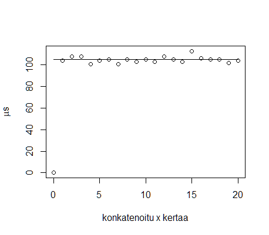

# Testaus
Enimm‰kseen on testattu, ett‰ eri salaukset enkryptaavat ja dekryptaavat oikein kutsumalla metodeja syˆtteell‰ jonka toivottu tulos on tunnettu (esim. paperilla ratkaistu). Testauksessa on tietenkin k‰ytetty JUnitia.

Frekvenssianalyysia on normi Caesar- ja Vigenere-salauksissa testattu antamalla pitk‰ satunnaisgeneroitu (ei testin aikana, aina sama) p‰tk‰ englanninkielist‰ teksti‰, salattu se, ja vaadittu ett‰ ohjelma saa purettua salauksen analyysin perusteella.

Koska keyed-varianttien automaattinen analysointi osoittautui liian hitaaksi (ainakin brute forcella, etsim‰ll‰ esim. sanoja I, and, the saattaisi onnistua, mutta menee paljon monimutkaisemmaksi), toteutettiin vain apuv‰line analysoida sit‰ itse, jota on tietenkin testattu vain manuaalisesti.

## Suorityskyky
Caesar-salauksessa kest‰‰ enkryptaa "testmessage" offsetill‰ 5 keskim‰‰rin . Toisin p‰in kest‰‰ noin 0.0029 ms. Testi oli 1000 suorituksen keskiarvo. Ero on outo, koska enkryptaus ja dekryptauksen ero on onko yksi laskutoimitus + vai -.
Vigenere-salauksessa sama viesti avaimella "test" kesti keskim‰‰rin noin 0.0056 ms salata, salauksen purkaminen 0.0033 ms.
Keyed-varianteilla avaimella key Caesar-salauksessa viestill‰ "testmessage" ja offsetill‰ 5 kesti keskim‰‰rin 0.0045 ms, dekryptaus taas 0.0046 ms. Vigenerell‰ (testmessage, test) aikaa kului salaukseen keskim‰‰rin 0.0055 ms ja purkuun 0.0040 ms.

Caesar-salauksen purku kesti keskiarvoisesti 1113 ns viestill‰ "Yjxyrjxxflj" (eli "testmessage" salattuna offsetill‰ 5), viestill‰ "YjxyrjxxfljYjxyrjxxflj" 2202 ns, ja konkatoituna viesti kolmannen kerran 3283 ns, jne.
Caesar salaus ja sen purku

Vigenere

(Huom. keyed-varianteilla aika mikro eik‰ nanosekunteja)

Keyed Caesar

Keyed Vigerene

### Analyysi
Caesar

